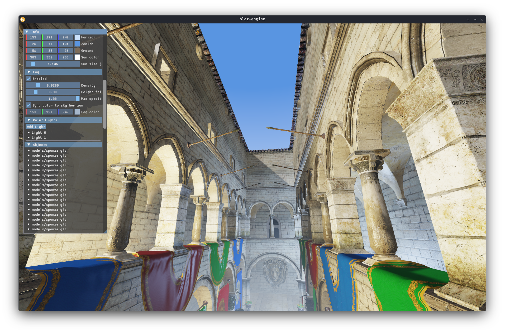
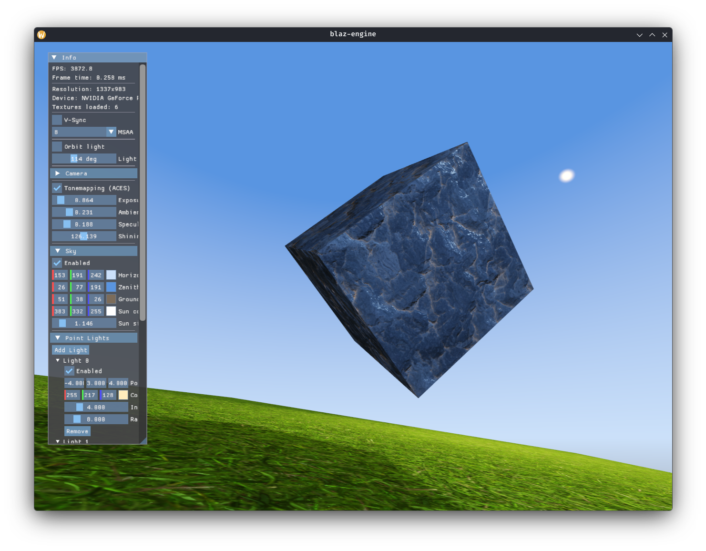

# Sparse notes on Vulkan and Computer Graphics

This repository documents my learning path in the field of Computer Graphics and a personal effort in improving my knowledge of C++, CMake, the Vulkan API and CG Rasterization techniques. The scope of this project is ever-evolving, based on the features I stumble upon my study.
It is in no way a complete product nor it is well-desgined but more like a personal laboratory, a tour if you will, to explore features and design principles.
My goal is to keep this repository well-maintained: trying to push for a commit a day keeps the doctor away and helps with remaining focused.

So watch how I fail and this repository gets forgotten in a month ;`) (So far I've been able to keep it up, but I'm writing this to make myself accountable)

Currently, after reaching the Compute Shaders chapter of the [Khronos Group's Vulkan Tutorial](https://docs.vulkan.org/tutorial/latest/00_Introduction.html), I've decided to diverge from the tutorial. Since the bulk of what makes a functioning Vulkan program was dealt with, my next goals were to create simple scenes with geometrical primitives, implementing effects like Shadow Mapping, Bump Mapping, Blinn-Phong lighting and a simple debug GUI through which move objects, lights, change properties and enable/disable/tweak various scene properties like skybox color, fog, shadow map bias and light positioning and color.

I'm integrating this study with well known resources, like learn-opengl.com, for a reference implementation of most of the effects. I'm also reading books like C++ Primer and Real Time Rendering 4th edition as I go, trying to make sense of some of the topics.

For the time being, relevant notes on the API itself will be in the [notes](./notes) folder.

## Building

> This project is being developed inside a Fedora container within Distrobox and is not being currently tested elsewhere.If you want to test it on other platforms and add some issues, you're welcome!

### Prerequisites

- CMake 3.29+
- Vulkan SDK 1.4.335+
- GLFW3, GLM, STB
- `slangc` (Slang shader compiler)

The Slang shared libraries (`libslang-compiler.so` etc.) must be on the system library path. If you installed `slangc` manually and only copied the binary, copy the accompanying `.so` files to `/usr/local/lib/` and run `sudo ldconfig`.

### Clone

This repository uses git submodules (Dear ImGui, fastgltf). Clone with:

```bash
git clone --recurse-submodules <repo-url>
```

If you already cloned without submodules:

```bash
git submodule update --init
```

### Compile and run

The repo ships a `CMakePresets.json` with three named configurations. The `run.sh` script is a thin wrapper that invokes the preset and then runs the binary:

```bash
./run.sh              # debug build (default, validation layers active)
./run.sh release      # release build (optimized, no validation)
./run.sh relwithdebinfo  # optimized + debug symbols + validation
```

You can also drive the build directly without the script:

```bash
cmake --workflow --preset debug   # configure + build
./_build/main                     # run
```

Or pick a preset from the CMake Tools status bar if you're using VSCode.

### What the build does

```
cmake --workflow --preset <name>
  │
  ├── Configure  (cmake -S . -B _build -DCMAKE_BUILD_TYPE=...)
  │     Reads CMakeLists.txt, generates Makefiles in _build/,
  │     copies assets/ (textures, models, scenes) into _build/.
  │
  └── Build  (cmake --build _build)
        Compiles scene.slang, shadow.slang, sky.slang → _build/shaders/*.spv,
        compiles ImGui sources and the C++ renderer → _build/main.

The binary resolves all asset paths relative to its own directory (_build/)
using /proc/self/exe, so it can be invoked from anywhere.
```


## Current state

<div align="center">
  
</div>

<div align="center">
  
</div>

<div align="center">
  
</div>


### Rendering

- **Shadow mapping** — dedicated depth pre-pass, 9-tap PCF filtering, slope-scale bias (tweakable min/max via ImGui to balance acne vs. peter panning)
- **Blinn-Phong lighting** — directional light with shadow casting, diffuse + ambient + specular
- **Specular maps** — per-texel tinted specular intensity (RGB), falls back to global specular strength slider
- **Normal mapping** — tangent-space normal maps; tangent vectors computed analytically for procedural meshes and via Gram-Schmidt for OBJ models, stored as `float4` with bitangent sign in `w`
- **Parallax Occlusion Mapping (POM)** — adaptive linear raymarch (8–32 steps) + 5-step binary refinement in tangent space; depth scale and step counts tunable in ImGui; activated per-object via `"heightMap"` in scene JSON
- **Point lights** — up to 4, polynomial `(1-(d/r)²)²` falloff, no shadow casting (by design); add/remove at runtime via ImGui
- **Procedural skybox** — fullscreen-triangle pass reconstructing view rays from `invProj`/`invViewRot`; three-zone gradient (ground/horizon/zenith) + sun disk; colors configurable in ImGui and scene JSON
- **ACES filmic tonemapping** — exposure control; toggle on/off at runtime
- **MSAA** — configurable sample count up to hardware max, live-switchable in ImGui
- **Exponential height fog** — density, height falloff, and max-opacity controls in ImGui; color optionally locked to the sky horizon color for seamless blending

### Scene

- **JSON scene descriptor** — objects with mesh (`cube`, `plane`, `sphere`, or file path), position, rotation, scale, texture, specularMap, normalMap, heightMap, vertex color; skybox colors and point lights also declared in JSON
- **Bindless texture array** — all textures in a single descriptor binding (`PARTIALLY_BOUND`), indexed via push constants; `0xFFFF` sentinel for "no texture"; up to 2048 slots
- **Per-object transform editing** — position, rotation (XYZ Euler), uniform scale via ImGui drag sliders, model matrix rebuilt on change
- **OBJ loading** — via tinyobjloader; tangent vectors computed per-triangle from UV deltas and accumulated + orthogonalised per vertex
- **GLTF/GLB loading** — via fastgltf; reads all primitives with their per-mesh transforms; extracts baseColor, normalMap, and metallicRoughness textures; handles both external image files and embedded GLB buffers; optional Y-up to Z-up axis remap

### Camera & controls

- **Free-fly camera** — hold RMB to enter fly mode (cursor captured), WASD + QE for movement, mouse for look; Z-up spherical coordinates
- **Camera parameters** — position, yaw, pitch, speed, sensitivity editable in ImGui

### Infrastructure

- **Dynamic rendering** (`VK_KHR_dynamic_rendering`) — no render pass objects; shadow, scene, sky, and ImGui each in their own `beginRendering`/`endRendering` block
- **Vulkan 1.2 features** — `descriptorIndexing`, `runtimeDescriptorArray`, `shaderSampledImageArrayNonUniformIndexing`, `scalarBlockLayout`
- **Swapchain** and **Device** abstracted into their own classes
- **Dear ImGui** integration with dynamic rendering backend
- **CMakePresets** — `CMakePresets.json` encodes debug/release/relwithdebinfo configurations; `run.sh` is a thin wrapper around `cmake --workflow`; IDE preset selection works out of the box with VSCode CMake Tools

### Future developments

The immediate goal is to consolidate and clean up what's here before adding more features. Current thoughts:

- Replace Blinn-Phong with a physically-based BXDF (Cook-Torrance or similar), using the metallic-roughness maps already extracted by the GLTF loader
- Better code organisation — the renderer class has grown large; splitting it into more focused subsystems or exploring render graph concepts (started: build system cleaned up with CMakePresets, asset path resolution made robust)
- Revisit implemented techniques to fix edge cases (shadow map coverage for large scenes, POM artifacts at silhouettes) and understand them better

---

## On the graphics pipeline

<div align="center">
  
</div>

Messy notes about general concepts:

- The pipeline is a **sequence of operations** that transform vertex/texture data into rendered pixels
- There are two kind of stages: **fixed-function** and **programmable**
    - Fixed function are **Input Assembler, Rasterization and Color Blending**
- Some programmable stages are optional, based on your intent.
    - Geometry or tessellation can be disabled for simple geometry, or the fragment shader can be disabled for shadow map generation

- Compared to other APIs, the graphics pipeline in Vulkan is **immutable**, and must be **recreated from scratch** if a change in shaders, blending function or a different framebuffer bind is needed.
    - Less ergonomics, more performance

- Detail on what every stage of the pipeline does are absent for now to avoid clutter, here are some highlights:
    - Vertex shader is used to apply transformation to every vertex
        - Vertices are simply points in a 3D space, bundled with certain additional attributes (like normals, colors etc)
    - Rasterization stage breaks primitives (triangles, lines, point) into **fragments** and here you can discard fragments based on their position relative to other fragments or the camera
    - Fragment shader is invoked for every surviving fragment and determines in which framebuffers the fragments are written to and with which color and depth
    - Color blending stage mixes different fragments that map to the same pixel.
        - For example if a transparent red glass has a yellow wall behind it, you'll mix the colors based on this information
    
## On the Vertex Shader
- Written in Slang, compiled to SPIR-V.
    - SPIR-V is a bytecode format and Vulkan has released a platform independent compiler to avoid GPU vendor specific oddities
    - Slang is a shading language with C-style syntax, similar with HLSL, with built-in vector and matrix primitives
- Input: World position, color, normal and texture coordinates of the incoming vertex
- Output: Final position in clip coordinates and the attributes that need to get passed on to the fragment shader
- **Clip coordinates** are four-dimensional vectors (x, y, z, w)
    - The 4th coordinate is what makes perspective work
    - Objects further away get a larger w
- Clip coordinates turn into **normalized device coordinates**, which are 3-dimensional vectors where every coordinate is divided by w.
    - (x/w, y/w, z/w)
    - They map the framebuffer into a [-1, 1] [-1, 1] coordinate system.
    - Vulkan flips the sign of the Y coordinate compared to OpenGL
        - It better reflects how image/texture memory layout actually works
        - Be mindful of backface culling and windling order when porting from OpenGL
